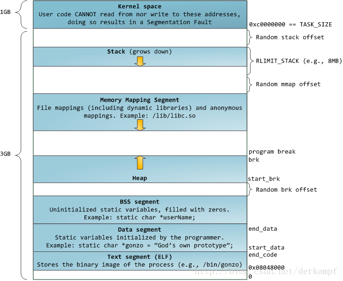

## C++篇

- [C++ 的三大特性](#1)
- [C++ 中的继承](#2)
- [多态的原理](#3)
- [虚函数的工作原理](#4)
- [构造函数可以是虚函数吗，析构函数呢](#5)
- [什么是纯虚函数](#6)
- [虚表指针存放的位置，头部还是尾部](#7)
- [如果多重继承只有一个虚表指针吗](#8)
- [编译器会为一个空类自动生成那些函数](#9)
- [函数模板和类模板的区别](#10)
- [什么是内存泄漏，怎么防止内存泄漏](#11)
- [智能指针有哪些，以及实现原理](#12)
- [什么是循环引用，怎么解决循环引用](#13)
- [你觉得这些定位开源定位内存泄露的工具是怎么实现的](#14)
- [C++11 nullptr 比 NULL 的优势](#15)
- [什么是类型萃取](#16)
- [C++ 有哪些创建线程的方式](#17)
- [C++ 怎么传递信号](#18)
- [C++ 和 python 的区别](#19)
- [深拷贝和浅拷贝的区别](#20)
- [指针和引用的区别](#21)
- [volatile 有什么作用](#22)
- [C++ 的内存分布](#23)
- [new 和 malloc 的区别](#24)
- [static 的作用](#25)
- [匿名表达式的具体应用和应用场合](#26)
- [class 和 struct 的区别](#27)
- [为什么有了 class 还保留了 struct](#28)
- [C++ 中如何调用 c 写的函数](#29)
- [extern c 的原理](#30)
- [重写、重载、覆盖的区别](#31)
- [成员初始化列表的概念，为什么用成员初始化列表会快一些（性能优势）](#32)
- [如何避免编译器进行的隐式类型转换](#33)
- [怎么访问私有函数](#34)
- [左值和右值的区别](#35)
- [空类占多少字节](#36)
- [用过哪些 STL 库](#37)
- [map 和 unordered_map 的底层实现和性能区别](#38)
- [vector 中的扩容原理和具体实现方式](#39)
- [如果让你实现 vector 动态删除然后容量缩小你会如何设计](#40)
- [为什么 stl 里面有 sort 函数 list 里面还要再定义一个 sort](#41)

<h3 id="1">C++ 的三大特性</h3>

---

三大特性：继承、多态、封装。

<h3 id="2">C++ 中的继承</h3>

---

**继承：**  
被继承的是父类（基类），继承出来的类是子类（派生类），子类拥有父类的所有的特性。  
继承方式有公有继承、私有继承，保护继承。默认是私有继承。

- 公有继承中父类的公有和保护成员在子类中不变，私有的在子类中不可访问。
- 私有继承中父类的公有和保护成员在子类中变为私有，但私有的在子类中不可访问。
- 保护继承中父类的公有和保护成员在子类中变为保护，但私有的在子类中不可访问。

C++ 语言允许单继承和多继承。  
优点：继承减少了重复的代码、继承是多态的前提、继承增加了类的耦合性。  
缺点：继承在编译时刻就定义了，无法在运行时刻改变父类继承的实现；父类通常至少定义了子类的部分行为，父类的改变都可能影响子类的行为；如果继承下来的子类不适合解决新问题，父类必须重写或替换，那么这种依赖关系就限制了灵活性，最终限制了复用性。  
虚继承：为了解决多重继承中的二义性问题，它维护了一张虚基类表。

<h3 id="3">多态的原理</h3>

---

1.在编译期间实现多态  
C++ 中通过重载函数的方法可以在编译期间实现多态，在编译时编译器会根据参数列表的不同寻找合适的函数。

2.使用虚函数实现多态  
C++ 中运行时多态可以通过声明一个虚函数来实现。虚函数分为纯虚函数和半虚函数。纯虚函数父类没有实现版本，完全交给子类，且必须实现。半虚函数父类可以实现，子类需要重写。它们都由关键字 virtual 修饰。  
重写虚函数时一定要保证函数的返回值，参数列表，函数名称完全一致。

<h3 id="4">虚函数的工作原理</h3>

---

实现原理：虚函数表 + 虚表指针。  
一个类中如果有了虚函数的声明，那么这些虚函数将由一个虚函数表来维护。编译器处理虚函数的方法是：为每个类对象添加一个隐藏成员，隐藏成员中保存了一个指向虚函数地址数组的指针，称为虚表指针，这种数组成为虚函数表。  
举个例子：基类对象包含一个虚表指针，指向基类中所有虚函数的地址表。派生类对象也包含一个虚表指针，指向派生类虚函数表。以下两种情况：

1. 派生类重写了基类的虚方法，该派生类虚函数表将保存重写的虚函数的地址，而不是基类的虚函数地址。
2. 如果基类中的虚方法没有在派生类中重写，那么派生类将继承基类中虚方法，而且派生类中虚函数表将保存基类中未被重写的虚函数的地址。注意，如果派生类中定义了新的虚方法，则该虚函数地址也将被添加到派生类的虚函数表中。

<h3 id="5">构造函数可以是虚函数吗，析构函数呢</h3>

---

构造函数不可以是虚函数，析构函数可以。  
因为虚函数的调用需要虚表指针，而虚表指针存放在对象的内存空间中，由构造函数初始化；若构造函数声明为虚函数，那么由于对象还未创建，还没有内存空间，更没有虚表指针用来调用虚函数的构造函数了。  
与构造函数不同，调用析构函数前，已经对虚表指针进行了初始化，所以析构函数可以声明为虚函数，并且有类继承时，最好将基类的析构函数设为虚函数，避免因为基类中申请的内存未释放而导致内存泄漏。

<h3 id="6">什么是纯虚函数</h3>

---

纯虚函数是基类中定义的虚函数，在基类中没有具体实现，必须由派生类来自己实现。

<h3 id="7">虚表指针存放的位置，头部还是尾部</h3>

---

存放在类的头部。

<h3 id="8">如果多重继承只有一个虚表指针吗</h3>

---

N 重继承就有 N 个虚表指针和 N 个虚函数表。

<h3 id="9">编译器会为一个空类自动生成那些函数</h3>

---

缺省构造函数、析构函数、拷贝构造函数、移动构造函数、赋值运算符、移动赋值运算符、两个取址运算符。

```c++
class Empty {
public:
    Empty();    // 缺省构造函数
    ~Empty();    // 析构函数
    Empty(const Empty&);    // 拷贝构造函数
    Empty(Empty&&); // 移动构造函数 (C++11)
    Empty& operator=(const Empty&);    // 赋值运算符
    Empty& operator=(Empty&&);    // 移动赋值运算符 (C++11)
    Empty* operator&();    // 取址运算符
    const Empty* operator&();    // 带const的取址运算符
};
```

<h3 id="10">函数模板和类模板的区别</h3>

---

函数模板：  
为了提高效率，实现代码复用，C++提供了一种处理机制，即使用函数模板。函数在设计时并不使用实际的类型，而是使用虚拟的类型参数。这样可以不必为每种不同的类型都编写代码段。当用实际的类型来实例化这种函数时，将函数模板与某个具体数据类型连用。编译器将以函数模板为样板，生成一个函数，即产生了模板函数，这个过程称为函数模板实例化。函数模板实例化的过程由编译器完成。程序设计时并不给出相应数据的类型，编译时，由编译器根据实际的类型进行实例化。  
类模板：  
通过类模板，可以实例化一个个的类。继承机制也是在系列的类之间建立某种联系，这两种涉及多个类的机制是有很大差异的。类是相同类型事物的抽象，有继承关系的类可以具有不同的操作。而模板是不同类型的事物具有相同的操作，实例化后的类之间没有联系，相互独立。

<h3 id="11">什么是内存泄漏，怎么防止内存泄漏</h3>

---

在 C++ 程序中，主要涉及到的内存就是`栈`和`堆`了。  
一个线程的栈内存是有限的，通常来说是 8M 左右（取决于运行的环境）。由于栈上的内存分配和回收都是由编译器控制的，左右在栈上不会发生内存泄漏，只会发生栈溢出，也就是分配的内存空间超过了规定的栈的大小。  
而堆上的内存是由程序直接控制的，程序可以通过 malloc/free 或 new/delete 来分配和回收内存空间，如果程序通过 malloc/new 来分配了一块内存，但忘记使用 free/delete 来回收内存，就发生了内存泄漏。  
防止内存泄漏：

1. 尽量避免在堆上分配内存。
2. 使用智能指针避免使用原始指针。
3. 善用 RAII 思想。
4. 养成良好的编程习惯，通过 malloc/new 分配的内存，一定要在不使用的时候通过 free/delete 回收。

<h3 id="12">智能指针有哪些，以及实现原理</h3>

---

auto_ptr(C++以弃用)、unique_ptr、shared_ptr 和 weak_ptr。  
unique_ptr：拥有独有对象所有权语义的智能指针，同一个时间内只能有一个智能指针指向该对象。实现原理是通过禁止拷贝语义、只有移动语义来实现。  
shared_ptr：拥有共享对象所有权语义的智能指针。采用引用计数的方式来实现，每拷贝一次内部的引用计数加 1，每析构一次内部的引用计数减 1，为 0 时自动删除所指向的堆内存。  
weak_ptr：到 shared_ptr 所管理对象的弱引用。weak_ptr 是为了配合 shared_ptr 而引入的一种智能指针，用于专门解决 shared_ptr 循环引用的问题，因为它不具有普通指针的行为，没有重载 operator \* 和 ->，它的最大作用在于协助 shared_ptr 工作，像旁观者那样观测资源的使用情况。weak_ptr 可以从一个 shared_ptr 或者另一个 weak_ptr 对象构造，获得资源的观测权。但 weak_ptr 没有共享资源，它的构造不会引起指针引用计数的增加。 weak_ptr 可以使用一个非常重要的成员函数 lock()，从被观测的 shared_ptr 获得一个可用的 shared_ptr 对象，从而操作资源。

<h3 id="13">什么是循环引用，怎么解决循环引用</h3>

---

循环引用：两个对象互相使用一个 shared_ptr 成员变量指向对方的会造成循环引用。  
示例：

```c++
class A {
public:
    shared_ptr<B> pb;
};
class B {
public:
    shared_ptr<A> pa;
};

int main() {
    shared_ptr<A> a(new A);
    shared_ptr<B> b(new B);
    cout << "a use count: " << a.use_count() << endl; // 1
    cout << "b use count: " << b.use_count() << endl; // 1
    if (a && b) {
        a->pb = b;
        b->pa = a;
    }
    cout << "a use count: " << a.use_count() << endl; // 2
    cout << "b use count: " << b.use_count() << endl; // 2
    return 0;
}
```

可以看到由于 a 和 b 内部的 shared_ptr 各自保存了对方的一次引用，所以导致了 a 和 b 销毁的时候都认为内部保存的指针计数没有变成 0，所以 a 和 b 的析构函数不会被调用，产生内存泄漏问题。解决方法就是把一个 shared_ptr 替换成 weak_ptr。

```c++
class A {
public:
    weak_ptr<B> pb;
};
class B {
public:
    weak_ptr<A> pa;
};

int main() {
    shared_ptr<A> a(new A);
    shared_ptr<B> b(new B);
    if (a && b) {
        a->pb = b;
        b->pa = a;
    }
    cout << "a use count: " << a.use_count() << endl; // 1
    cout << "b use count: " << b.use_count() << endl; // 1
    return 0;
}
```

使用 weak_ptr 并不会引起 shared_ptr 计数增加，所以可以解决循环引用的问题。

<h3 id="14">你觉得这些定位开源定位内存泄露的工具是怎么实现的</h3>

---

Memcheck 能够检测出内存问题，关键在于其建立了两个全局表。

1. Valid-Value map：  
   对于进程的整个地址空间中的每一个字节(byte)，都有与之对应的 8 个 bits；对于 CPU 的每个寄存器，也有一个与之对应的 bit 向量。这些 bits 负责记录该字节或者寄存器值是否具有有效的、已初始化的值。
2. Valid-Address map：  
   对于进程整个地址空间中的每一个字节(byte)，还有与之对应的 1 个 bit，负责记录该地址是否能够被读写。

检测原理：

- 当要读写内存中某个字节时，首先检查 valid-address map 中这个字节对应的 A bit。如果该 A bit 显示该位置是无效位置，memcheck 则报告读写错误。
- 内核（core）类似于一个虚拟的 CPU 环境，这样当内存中的某个字节被加载到真实的 CPU 中时，该字节对应的 V bit (在 valid-value map 中) 也被加载到虚拟的 CPU 环境中。一旦寄存器中的值，被用来产生内存地址，或者该值能够影响程序输出，则 memcheck 会检查对应的 V bits，如果该值尚未初始化，则会报告使用未初始化内存错误。

<h3 id="15">C++11 nullptr 比 NULL 的优势</h3>

---

在编译器解释程序时，NULL 会直接被解释为 0。  
C++ 11 引入了一个新的关键字 nullptr，作为空指针常量。不同于 NULL，其行为不实现定义。它不是宏，但是具有自己的类型。nullptr 具有类型 std::nullptr_t。C++ 11 适当地限定了用于 nullptr 避免 NULL 的缺点的性质。

<h3 id="16">什么是类型萃取</h3>

---

类型萃取是使用模板技术来萃取类型(包含自定义类型和内置类型)的某些特性，用以判断该类型是否含有某些特性，从而在泛型算法中来对该类型进行特殊的处理用来提高效率或者其他。  
应用场景：  
比如我们实现顺序表，在对顺序表进行扩容时，就靠重新开辟内存、拷贝对象。  
拷贝对象时，就有两种情况：一种是内置类型，比如 int char…；还有一种是自定义类型， Data 类、String 类。  
对于内置类型，我们可以通过 memset，来进行赋值。(扩展，浅拷贝相关的类也可以通过 memset 赋值)。  
而对于自定义类型，大多数深拷贝的对象来说，我们必须通过调用赋值语句来赋值。  
因此，我们通常在拷贝对象时，为了不出现错误，都用赋值语句来赋值。  
而我们如果有一种方法/机制可以判断 POD 类型或者非 POD 类型，对于 POD 类型用 memset 函数,对于非 POD 用赋值，这样就能提高程序的效率。

<h3 id="17">C++ 有哪些创建线程的方式</h3>

---

1.普通方式

```c++
void thread_func() {
    cout << "线程执行" << endl;
}

int main() {
    thread t(thread_func);
    thread_func.join();
    return 0;
}
```

2.成员方法

```c++
class Cthread {
public:
    void thread_func() {
        cout << "线程执行" << endl;
    }
};

int main() {
    thread t(&Cthread::thread_func);
    t.join();
    return 0;
}
```

3.lambda 方式

```c++
int main() {
    thread t([](int a, int b){
        cout << a + b << endl;
    }, 1, 2);
    t.join();
    return 0;
}
```

4.仿函数

```c++
struct functor {
    void operator()(int a, int b) {
        cout << a + b << endl;
    }
};
int main() {
    thread t(functor(), 2, 3);
    t.join();
    return 0;
}
```

5.绑定对象

```c++
class Cthread {
public:
    void thread_func() {
        cout << "线程执行" << endl;
    }
};

int main() {
    thread t(bind(&Cthread::thread_func));
    t.join();
    return 0;
}
```

<h3 id="18">C++ 怎么传递信号</h3>

---

C++ 信号处理库提供了  signal 函数，用来捕获突发事件。  
使用函数  raise()  生成信号，该函数带有一个整数信号编号作为参数。

<h3 id="19">C++ 和 python 的区别</h3>

---

1.C++ 是编译型语言；python 为解释型的脚本语言。
2.C++ 效率高，编程难；python 效率低，编程简单。

<h3 id="20">深拷贝和浅拷贝的区别</h3>

---

浅拷贝只是对指针的拷贝，浅拷贝后两个指针指向同一个内存空间。  
深拷贝不仅对指针进行拷贝，而且对指针指向的内容进行拷贝，经深拷贝后的指针是指向两个不同地址的指针。

<h3 id="21">指针和引用的区别</h3>

---

引用的底层实现方式：引用变量由指针按照指针常量的方式实现。  
对于指针来说，它是一个地址，这个地址是一个数值，那么就意味这个数值可以为 0(空指针)，也可以为其他，即指针可以不指向任何东西。  
而对于引用来说，他是一个外号，外号一定是“某个存在物体”的外号，所以引用不能为空，即不能存在空引用。  
根据以上可知指针和引用的一个重要不同：指针可以为空，引用不能为空。这就意味着我们拿到一个引用的时候，是不需要判断引用是否为空的，而拿到一个指针的时候，我们则需要判断它是否为空。这点经常在判断函数参数是否有效的时候使用。

<h3 id="22">volatile 有什么作用</h3>

---

volatile 关键字的含义是：告诉编译器它所修饰的变量随时都有可能改变，因此编译后的程序每次存储或者读取这个变量的时候，都会直接从变量地址中读取数据。如果没有 volatile 关键字，则编译器可能优化读取和存储，可能暂时使用寄存器中的值，如果这个变量由别的程序更新了的话，将出现不一致的现象。

<h3 id="23">C++ 的内存分布</h3>

---

进程的虚拟地址空间分布：


C++ 的内存分布：

- 栈区(stack)：由编译器自动分配释放，存储函数的参数值，返回值和局部变量值等，在程序运行过程中实时分配和释放，栈区由操作系统自动管理，无须程序员手动管理。
- 堆区(heap)：一般由程序员申请（new/malloc）和释放(delete/free)，与数据结构中的堆没有任何关系，分配方式类似于链表。
- BSS 段(Block Started by Symbol)：.bss 段被用来存放那些没有初始化或者初始化为 0 的全局变量。bss 段只占运行时的内存空间而不占文件空间。在程序运行的整个周期内，.bss 段的数据一直存在。
- 全局/静态区(static)：全局变量和静态变量是存储在一起的，在程序编译时分配，程序结束后由系统回收。
- 文字常量区：存储常量字符串。
- 程序代码区：存储函数体(类的成员函数、全局函数)的二进制代码

<h3 id="24">new 和 malloc 的区别</h3>

---

● 最大的区别是：new 在申请空间的时候会调用构造函数创建对象；而 malloc 不会调用。
new 在堆上创建对象，并返回该对象的指针，所谓创建的意思，就是调用该类的构造函数，如果不构造的话，就不能称之为对象。
malloc 只是在堆上分配了一段与该对象大小匹配的内存空间，然后再强行解释（强转）为这是一个对象，按这个逻辑来说，也不存在构造函数什么事了。
● 申请失败返回：new 在申请空间失败后返回错误码 bad_alloc；malloc 在失败后返回 NULL。
● 属性上：new/delete 是 C++ 关键字需要编译器支持；malloc 是库函数，需要添加头文件。
● 成功返回类型：new 操作符申请空间成功时，返回的是对象类型的指针，无需转换，因此 new 是类型安全性操作符；而 malloc 申请成功后返回 void\*，需要强制类型转换为我们需要的类型。
● 重载：new 操作符允许重载；malloc 不允许重载。

<h3 id="25">static 的作用</h3>

---

static 是 C++ 的关键字，可以修饰函数、局部变量、全局变量、类成员变量、类成员函数。

- 修饰函数：函数只能在本文件内引用，其它文件不可调用该函数。
- 修饰类成员函数：调用的时候可以不依赖对象，直接 类名::函数名 就可以调用。
- 修饰类成员变量：存储在 data 段，不属于对象私有，类实例化的对象共享一个变量。
- 修饰全局变量：存储在 data 段，只有本文件可见。
- 修饰局部变量：存储在 data 段，只有本文件可见，只在第一次使用的时候初始化，后面不再初始化。

<h3 id="26">匿名表达式的具体应用和应用场合</h3>

---

1. 在 for_each 中使用
2. 创建一个简单的线程
3. 线程同步中，条件变量等待的判断。
4. 与 function 结合，作为函数的入参。
5. 在 std::remove_if 中使用。

<h3 id="27">class 和 struct 的区别</h3>

---

1. class 默认权限为 private；struct 默认权限为 public。
2. class 默认继承权限为 private；struct 默认继承权限为 public。

<h3 id="28">为什么有了 class 还保留了 struct</h3>

---

C++ 保留 struct 是为了兼容 C。

<h3 id="29">C++ 中如何调用 c 写的函数</h3>

---

需要加上 extern "C" 声明。

<h3 id="30">extern c 的原理</h3>

---

C++ 在调用 C 的函数，在编译阶段将调用 C 的函数以 C++ 的方式编译，而 C 文件中的该函数却是以 C 的方式编译，在链接阶段就找不到对应的函数符号而导致链接失败。加上 extern c 是为了告诉编译器，在调用 C 函数时，不以 C++ 的方式编译。

<h3 id="31">重写、重载、覆盖的区别</h3>

---

重写：发生在继承中，是指派生类中存在重新定义的函数，其函数名，参数列表，返回值类型都必须同基类中被重写的函数一致，基类被重写的函数必须由 virtual 修饰。  
重载：几个具有不同函数参数（参数类型，顺序，个数不同）的同名函数，根据参数列表来确定调用哪个函数，重载不关心函数返回值。  
覆盖：应该是和重写一个意思吧。

<h3 id="32">成员初始化列表的概念，为什么用成员初始化列表会快一些（性能优势）</h3>

---

先看不用成员初始化列表的代码：

```c++
class Integer {
public:
    Integer() { cout << "Integer 默认构造函数" << endl; }
    Integer(int data) {
        cout << "Integer(int data) 构造函数， data：" << data << endl;
    }
};

class TestInteger {
    Integer _int;
public:
    TestInteger() { cout << "TestInteger 默认构造函数" << endl; }
};

TestInteger::TestInteger(int data) {
    cout << "TestInteger(int data) 构造函数" << endl;
    _int = data;
}

TestInteger(12);
/* output:
 * Integer 默认构造函数
 * TestInteger(int data) 构造函数
 * Integer(int data) 构造函数， data：12
 */
```

上面的初始化方式是在构造函数的函数体内给成员变量赋值，那么初始化 TestInteger 对象时步骤如下：

1. 首先调用 Integer 的默认构造函数给 \_int 赋值。
2. 然后进入 TestInteger 的构造函数体内。
3. 再调用 Integer 的 = 操作符进行赋值给 \_int 成员变量。

再看下面使用成员初始化列表的代码：

```c++
TestInteger::TestInteger(int data) : _int(data) {
    cout << "TestInteger(int data) 构造函数" << endl;
}

TestInteger(12);
/* output:
 * TestInteger(int data) 构造函数
 * Integer(int data) 构造函数， data：12
 */
```

可以看到，用初始化成员列表的方式，将会减少一次 Integer 默认构造函数的调用，使得程序性能提升。

<h3 id="33">如何避免编译器进行的隐式类型转换</h3>

---

1. 通过重载避免。
2. 使用 explict 修饰构造函数。

<h3 id="34">怎么访问私有函数</h3>

---

可以通过 friend 关键字修饰的友元类或者友元函数来访问。

<h3 id="35">左值和右值的区别</h3>

---

左值与右值这两个概念是从 C 中传承而来的，左值指既能够出现在等号左边，也能出现在等号右边的变量；右值则是只能出现在等号右边的变量。

- 左值是可寻址的变量，有持久性；
- 右值一般是不可寻址的常量，或在表达式求值过程中创建的无名临时对象，短暂性的。

<h3 id="36">空类占多少字节</h3>

---

空类占用 1 个字节，这是为了让对象的实例能够相互区别。因为空类也可以被实例化，并且每个实例在内存中是独一无二的，因此，编译器会给空类加上一个字节，使得它在内存中存在。  
空类作为基类，该类的大小就优化为 0。

<h3 id="37">用过哪些 STL 库</h3>

---

vector、list、map、set、unordered_map、unordered_set

<h3 id="38">map 和 unordered_map 的底层实现和性能区别</h3>

---

map 底层使用红黑树实现；unordered_map 底层使用哈希表实现。

- 查找效率：map 为 O(logn)；unordered_map 为 O(1);
- 插入效率：map 为 O(logn)；unordered_map 为 O(1);
- 删除效率：map 为 O(logn)；unordered_map 为 O(1);

map 是顺序容器；unordered_map 为无序容器。

<h3 id="39">vector 中的扩容原理和具体实现方式</h3>

---

1. vector 通过一段连续的内存空间存放元素，如果集合已满，在新增数据的时候，就要分配一快更大的内存空间，将原来的的数据复制过来，释放之前的内存，再插入新的数据。
2. 对 vector 的任何操作，一旦引起空间重新配置，指向原 vector 的所有迭代器都将失效。
3. 初始的 vector 的容量为 0，插入第一个元素后容量为 1。
4. 不同编译器实现的扩容方式不一样，gcc 为 2 倍， vs2017 为 1.5 倍。

<h3 id="40">如果让你实现 vector 动态删除然后容量缩小你会如何设计</h3>

---

```c++
template <typename T>
void shrinkage（vector<T>& v） {
    // 因为扩容是size的2倍，那么缩容的条件应该是当前容量大于size的4倍
    if (v.size() * 4 >= v.capacity()) return;
    v.resize(v.size() * 2);
    // 使用v来初始化匿名的vector对象（此时匿名对象的容量为缩容后的容量）
    // 再通过swap交换匿名对象和v
    vector<T>(v).swap(v);
}
```

<h3 id="41">为什么 stl 里面有 sort 函数 list 里面还要再定义一个 sort</h3>

---

sort() 函数模板定义在头文件 algorithm 中，要求使用随机访问迭代器。但 list 容器并不提供随机容器迭代器，只提供双向迭代器，因此不能对 list 中的元素使用 sort() 算法。  
所以 list 模板定义了自己的 sort() 函数（归并排序）。
