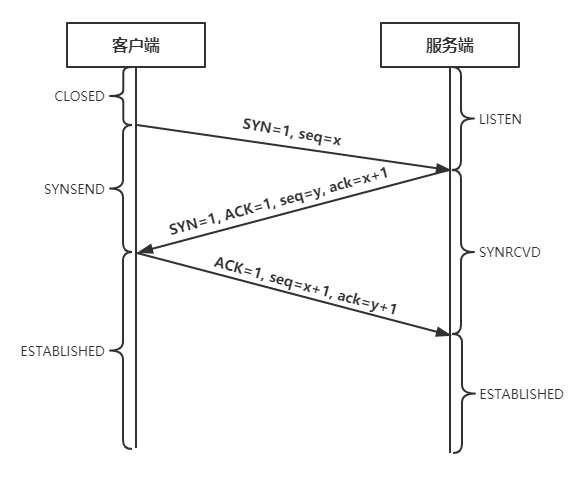
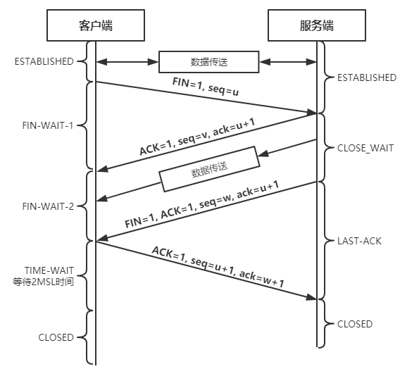
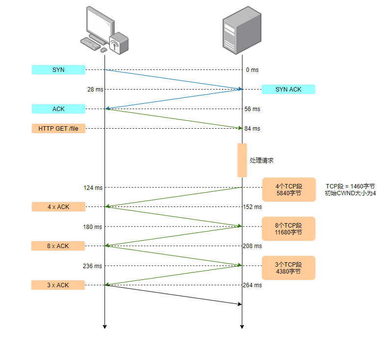

# 网络通信

- [tcp 和 udp 的区别](#1)
- [如何实现基于 udp 的可靠协议](#2)
- [tcp, udp 是那一层的协议](#3)
- [tcp 怎么保证可靠性](#4)
- [tcp 的停止等待协议是什么](#5)
- [三次握手和四次挥手](#6)
- [可以是两次握手吗](#7)
- [为什么要 timewait，timewait 有什么缺点](#8)
- [滑动窗口的原理](#9)
- [网线断开会发生什么，哪一端会先断开](#10)
- [tcp 最大连接数限制](#11)
- [什么是 tcp 粘包，怎么解决](#12)
- [流量控制和拥塞控制的区别](#13)
- [为什么有了 mac 地址还需要 ip 地址](#14)
- [Http1.1 和 Http1.0 的区别](#15)
- [URI（统一资源标识符）和 URL（统一资源定位符）之间的区别](#16)
- [为什么服务端易受到 SYN 攻击](#17)
- [get 和 post 的区别，get 的长度限制是多少](#18)
- [浏览器打开网站的过程](#19)
- [IP 的五元组构成](#20)
- [如何在单台 Linux 服务器上实现百万 TCP 连接](#21)
- [select, poll, epoll 的区别](#22)
- [tcp 慢启动](#23)
- [HTTPS 的通信过程](#24)

<h3 id="1">tcp 和 udp 的区别</h3>

---

|              | tcp                                  | udp                      |
| ------------ | ------------------------------------ | ------------------------ |
| 是否连接     | 无连接                               | 面向连接                 |
| 是否可靠     | 不可靠传输，不是用流量控制和拥塞控制 | 可靠传输                 |
| 连接对象个数 | 支持 N 对 N 通信                     | 只支持 1 对 1 通信       |
| 传输方式     | 面向报文                             | 面向字节流               |
| 首部开销     | 8 字节                               | 20 ~ 60 字节             |
| 适用场景     | 适用与实时应用                       | 适用与需要可靠传输的应用 |

<h3 id="2">如何实现基于 udp 的可靠协议</h3>

---

1. 增加确认机制，接收方收到 udp 包后回复个确认包。
2. 发送方增加超时重传机制，当包发送出去后，没有得到接收方确认包，就需要重新发送该包。
3. 增加滑动窗口，当网络太差频繁丢包时，防止越丢包越重传的恶性循环，要有个发送窗口的限制，窗口大小根据网络状况使用相应的调整算法来适应。

<h3 id="3">tcp, udp 是那一层的协议</h3>

---

传输层。

<h3 id="4">tcp 怎么保证可靠性</h3>

---

1. 建立连接需要三次握手，断开连接需要四次挥手。
2. 超时重传机制。
3. TCP 包的校验和。
4. 序列号和确认应答。
5. 流量控制。
6. 拥塞控制（慢启动，拥塞避免，快重传，快恢复）。

<h3 id="5">tcp 的停止等待协议是什么</h3>

---

发送方每发送完一个分组就停止发送，等待接收方的确认应答，在收到确认应答后再发送下一个分组。

<h3 id="6">三次握手和四次挥手</h3>

---

三次握手:

四次挥手：

<h3 id="7">可以是两次握手吗</h3>

---

**不可以。**  
当客户端发起一个连接请求时，由于某些原因导致请求在网络中长时间驻留，无法达到服务端，由于 TCP 的超时重传机制，客户端会再次发次一个连接请求，该请求能顺利到达服务端并建立连接，当数据传输完后，释放了 TCP 连接。  
这时若是第一次连接的请求到达了服务端，此时的请求已经是一个失效的报文段了，但是服务端并不知情，接收到连接请求后服务端会再次建立连接，于是服务端发送一个确认应答的消息给客户端，表示同意连接。如果没有第三次握手，由于服务端此时会认为已经建立连接成功，但是客户端并没有发送任何请求和数据，客户端将会忽略掉服务端的确认应答报文。服务端认为建立成功了，并一直等待建立连接，直到超出计数器的设定值，则认为出现了异常并关闭此连接。这个等待的过程浪费了服务端的资源。

<h3 id="8">为什么要 timewait，timewait 有什么缺点</h3>

---

TCP 正常关闭连接时，主动关闭的一方会进入 TIME_WAIT 状态，时间为 2MSL。  
假设最终的 ACK 丢失，对端将重发 FIN，本端必须维护 TCP 状态信息以便可以重发最终的 ACK，否则会发送 RST，结果对端认为发生错误。TCP 实现必须可靠地终止连接的两个方向(全双工关闭)，本端必须进入 TIME_WAIT 状态，因为本端可能面临重发最终 ACK 的情形。  
缺点：  
在高并发短连接的 TCP 服务器上，当服务器完成请求后会正常关闭连接。在这个场景下，会出现大量 socket 处于 TIME_WAIT 的状态下。如果客户端的并发量持续很高，会使服务器端口资源不足而拒绝部分客户端的连接请求。

<h3 id="9">滑动窗口的原理</h3>

---

[TCP 滑动窗口原理](https://blog.csdn.net/qq_31965925/article/details/107844684)

<h3 id="10">网线断开会发生什么，哪一端会先断开</h3>

---

假如客户端的网线断开，那么服务端并不会知道，如果不主动处理或重启服务的话对于服务端会一直保持着这个连接，永远等不到客户端的任何回应。这种情况就是半开链接，浪费了服务端可用的文件描述符。

<h3 id="11">tcp 最大连接数限制</h3>

---

一条 TCP 连接由四元组（源 IP 地址，源端口，目的 IP 地址，目的端口）构成，理论上改变其中一个值，将得到一条全新的 tcp 连接。
然而实际上最大连接数受限于：

1. Linux 最大可打开文件数（可更改）。
2. 内存限制：一条空的 TCP 连接需要消耗 3.3KB 左右（file、socket 等内核对象）。
3. 如果收发数据，还需要再开启接收（默认 4K）、发送（默认 4K）缓冲区，会增加内存的开销（还会增加 CPU 的负担）。

<h3 id="12">什么是 tcp 粘包，怎么解决</h3>

---

tcp 粘包：tcp 是“流”协议，所谓流协议，就是数据没有界限，没有分割的一串数据。tcp 协议会根据缓冲区实际情况进行划分，一个完整的包可能会拆分成多个包进行发送，也有可能多个小包封装成一个大的数据包发送。  
解决方法：

1. 消息数据定长：每次都发送固定长度的包，长度不足的补充空格，缺点是浪费了部分存储空间和带宽，并且不够灵活。
2. 消息数据约定以某些特殊字符为消息边界。
3. 把消息数据分成消息头（header）和消息体（payload），消息头中带有消息的长度，接收到根据消息头中的长度解析数据。

<h3 id="13">流量控制和拥塞控制的区别</h3>

---

流量控制：指点对点通信量的控制，是端到端的问题。流量控制所要做的就是抑制发送端发送数据的速率，以便使接收端来得及接收。  
拥塞控制：防止过多的数据注入到网络中，这样可以使网络中的路由器或链路不致过载。拥塞控制所要做的都有一个前提：网络能够承受现有的网络负荷。拥塞控制是一个全局性的过程，涉及到所有的主机、路由器，以及与降低网络传输性能有关的所有因素。

<h3 id="14">为什么有了 mac 地址还需要 ip 地址</h3>

---

因为如果我们只用 MAC 地址的话,我们会发现路由器需要记住每个 MAC 地址所在的子网是哪一个(不然每一次收到数据包的时候路由器都要重新满世界地去找这个 MAC 地址的位置)。而世界上有非常非常多 MAC 地址,这就意味着即使我们给每个 MAC 地址只留 1 字节的储存空间，每个路由器也需要 256TB 的内存!这显然是不可能实现的。这就是我们需要 IP 地址的原因了。和 MAC 不同的是，IP 地址是和地域相关的。对于位于同一个子网上的设备,我们给他们分配的 IP 地址前缀都是一样的，这个前缀就像邮政编码一样。这样，路由器过 IP 地址的前缀就能知道这个设备在哪个子网上了。现在,路由器只需要记住每个子网的位置即可，大大减少了路由器所需要的内存。

<h3 id="15">Http1.1 和 Http1.0 的区别</h3>

---

1. 长连接：Http1.1 支持长连接，1.0 不支持。
2. 流水线：Http1.1 支持在一个 TCP 连接上传送多个 HTTP 请求和相应，1.0 不支持。
3. host 字段：在 HTTP1.0 中认为每台服务器都绑定一个唯一的 IP 地址，因此，请求消息中的 URL 并没有传递主机名（hostname）。但随着虚拟主机技术的发展，在一台物理服务器上可以存在多个虚拟主机（Multi-homed Web Servers），并且它们共享一个 IP 地址。
   HTTP1.1 的请求消息和响应消息都应支持 Host 头域，且请求消息中如果没有 Host 头域会报告一个错误（400 Bad Request）。此外，服务器应该接受以绝对路径标记的资源请求。
4. cache：HTTP1.1 在 1.0 的基础上加入了一些 cache 的新特性，当缓存对象的 Age 超过 Expire 时变为 stale 对象，cache 不需要直接抛弃 stale 对象，而是与源服务器进行重新激活(revalidation)。

<h3 id="16">URI（统一资源标识符）和URL（统一资源定位符）之间的区别</h3>

---

URL 是一种 URI，它标识一个互联网资源，并指定对其进行操作或获取该资源的方法。可能通过对主要访问手段的描述，也可能通过网络“位置”进行标识。URI 可被视为定位符（URL），名称（URN）或两者兼备。统一资源名（URN）如同一个人的名称，而统一资源定位符（URL）代表一个人的住址。换言之，URN 定义某事物的身份，而 URL 提供查找该事物的方法。URN 仅用于命名，而不指定地址。

<h3 id="17">为什么服务端易受到 SYN 攻击</h3>

---

1. 服务端的资源是在二次握手时分配的，而客户端是三次握手时才分配。
2. SYN 攻击，即客户端在短时间内伪造大量不存在的 IP 地址，并向服务端不断的发送 SYN 包，服务端收到请求即回复确认，并等待客户端的确认，由于源地址不存在，因此服务端需要不断的重发直到超时；
3. 这些伪造的 SYN 包长时间占用未连接队列，导致正常的 SYN 请求因为队列满而丢弃，因为网络拥塞。
4. 一般服务端会重试 5 次。

<h3 id="18">get 和 post 的区别，get 的长度限制是多少</h3>

---

1. GET 请求的数据会附在 URL 之后，以 ? 分割 URL 和传输数据，参数之间以 & 相连；POST 把提交的数据则放置在是 HTTP 包的包体中。
2. GET 的长度受限于 URL 的长度，而 URL 的长度限制是特定的浏览器和服务器设置的，理论上 GET 的长度可以无限长；POST 无限制。
3. GET 历史参数保留在浏览器历史中。POST 参数不会保存在浏览器历史中。
4. 与 POST 相比，GET 的安全性较差，因为所发送的数据是 URL 的一部分。在发送密码或其他敏感信息时绝不要使用 GET ！POST 比 GET 更安全，因为参数不会被保存在浏览器历史或 web 服务器日志中。
5. GET 的数据在 URL 中对所有人都是可见的。POST 的数据不会显示在 URL 中。

<h3 id="19">浏览器打开网站的过程</h3>

---

1. 用户在浏览器地址栏输入网址，浏览器获得域名，而实际通信过程中需要的是一个 IP 地址。所以首先会从浏览器自身缓存中查看 DNS 记录，如果没有找到或者过期，则搜索 hosts 文件和操作系统缓存，如果还是没有，则向域名解析服务器发送解析请求（DNS），如果还是没有，则开始递归+迭代解析。
2. 获取到服务器 IP 地址后，开始建立 TCP 连接请求。
3. 发送 HTTP 请求。
4. 得到服务器响应的 HTTP 结果后，开始进行浏览器页面渲染。
5. 渲染过程中，会发现页面引用了一些其他的静态资源，浏览器将会根据资源的 URL 下载这些资源。

<h3 id="20">IP 的五元组构成</h3>

---

源 IP 地址，源端口，传输层协议，目的 IP 地址，目的端口

<h3 id="21">如何在单台 Linux 服务器上实现百万 TCP 连接</h3>

---

我们知道，一条 TCP 连接由四元组（源 IP 地址，源端口，目的 IP 地址，目的端口）组成，任意一个元素发生改变，那么就代表的是一条完全不同的连接。在一个服务中，它的目的 IP 地址、目的端口都是固定的，剩下源 IP 地址、源端口是可变的。所以理论上一个服务最多可以建立 2^32（IP 数）x 2^16（端口数）≈ 200 多万亿个连接（fd）。但实际上并不能建立这么多的连接，它受限于：

1. Linux 最大可打开文件数（可更改）。
2. 内存大小，一条空的 TCP 连接需要消耗 3.3KB 左右（file、socket 等内核对象）。
3. 如果收发数据，还需要再开启接收（默认 4K）、发送（默认 4K）缓冲区，会增加内存的开销（还会增加 CPU 的负担）。

所以建立百万 TCP 连接需要具备以下条件：

1. 更改 Linux 的最大可打文件数（系统级，用户级，进程级）。
2. 一条空 TCP 连接需要 3.3KB，一百万条就需要将近 3.2G 的内存，所以内存最小要 4G。

<h3 id="22">select, poll, epoll 的区别</h3>

---

**select**  
优点：

- select 遵循 POSIX 的规范，支持跨平台，具有良好的兼容性，可以在不同操作系统上使用 select 实现高性能服务器。

缺点：

- 单个进程能打开的最大连接数有限制，只能打开最大为 FD_SETSIZE 宏定义大小的连接数。
- 当有新的连接时，每次都需要将所有的 fd 集合从用户空间拷贝到内核空间，开销大。
- 当有新的 IO 事件发生时，每次都需要将所有的 fd 集合从内核空间拷贝到用户空间，开销大。
- 需要轮询遍历所有 fd 集合，才能知道哪些 fd 就绪，时间复杂度为 O(N)。

**poll**  
优点：

- 相较于 select，poll 是基于链表来存储 fd 集合的，所以并不会像 select 那样存在最大的连接数限制（受服务器资源限制）。

缺点：

- 非跨平台，只能在 Unix/Linux 操作系统上开发。
- 同 select 一样，都会有大量的 fd 集合被整体复制于用户空间和内核空间之间，开销大。
- IO 效率与 select 一样，都需要轮询遍历所有 fd 集合，才能知道哪些 fd 就绪，时间复杂度为 O(N)。

**epoll**  
优点：

- 理论上同样不存在最大连接数限制（受服务器资源限制）。
- 效率提升，只有活跃的 fd 才会主动调用 callback 回调函数，时间复杂度为 O(1)。
- 底层由红黑树来管理 fd 集合，通过就绪队列链表将就绪的 fds 拷贝到用户空间，而不需要将所有 fd 集合全部拷贝，省去了不必要的内存拷贝。

<h3 id="23">tcp 慢启动</h3>

---

最初 TCP 的实现方式是，在连接建立成功后便会向网络中发送大尺寸的数据包，假如网络出现问题，很多这样的大包会积攒在路由器上，很容易导致网络中路由器缓存空间耗尽，从而发生拥塞。  
因此现在的 TCP 协议规定了，新建立的连接不能够一开始就发送大尺寸的数据包，而只能从一个小尺寸的包开始发送，在发送和数据被对方确认的过程中去计算对方的接收速度，来逐步增加每次发送的数据量（最后达到一个稳定的值，进入高速传输阶段。相应的，慢启动过程中，TCP 通道处在低速传输阶段），以避免上述现象的发生。这个策略就是慢启动。

缺点：  
慢启动导致客户端与服务器之间经过几百毫秒才能达到接近最大速度的问题，大于大型流式下载服务的影响倒不明显，因为慢启动的时间可以分摊到整个传输周期内消化掉。  
可是对于很多 http 连接，特别是一些短暂、突发的连接而言，常常会出现还没有达到最大窗口请求就被终止的情况。换句话说，很多 Web 应用的性能经常受到服务器与客户端之间往返时间的制约。因为慢启动限制了可用的吞吐量，而这对于小文件传输非常不利。

如下图，HTTP 请求的流程：  

解决方案：  
可以看到，按默认 cwnd 为 4 的情况下，从服务器返回的 20kb 的数据需要往返三次，耗时 264ms。如果将 cwnd 的值改为 15，则只需要一次往返，152ms，大大提升了性能。

<h3 id="24">HTTPS 的通信过程</h3>

---

基本概念：`HTTPS协议 = HTTP协议 + SSL/TLS协议`。
准备工作，服务器申请证书的过程：

1. 服务端生成自己的公私钥，公钥 S.pub，私钥 S.pri
2. 将公钥 S.pub 给权威的 CA 机构
3. CA 机构生成公私钥 CA.pub 和 CA.pri。再使用 CA.pri 对你的 S.pub 签名生成 CA 证书，再将 CA 证书颁发给服务器
4. 各个电脑手机等终端生产的时候都内置了 CA 机构的根证书，CA 的公钥 CA.pub

浏览器和服务器的交互过程：

1. 客户端发起一个 http 请求，连接到服务器的 443 端口。
2. 服务端把自己的信息以数字证书的形式返回给客户端（证书内容有密钥公钥，网站地址，证书颁发机构，失效日期等）。证书中有一个公钥来加密信息，私钥由服务器持有。
3. 验证证书的合法性，浏览器收到服务器的响应后会先验证证书的合法性（证书中包含的地址与正在访问的地址是否一致，证书是否过期）。
4. 生成随机密码（RSA 签名），如果验证通过，或用户接受了不受信任的证书，浏览器就会生成一个随机的对称密钥（session key）并用公钥加密，让服务端用私钥解密，解密后就用这个对称密钥进行传输了，并且能够说明服务端确实是私钥的持有者。
5. 生成对称加密算法，验证完服务端身份后，客户端生成一个对称加密的算法和对应密钥，以公钥加密之后发送给服务端。此时被黑客截获也没用，因为只有服务端的私钥才可以对其进行解密。之后客户端与服务端可以用这个对称加密算法来加密和解密通信内容了。

浏览器验证过程：

1. 拿到证书，得到明文 T，签名 S（服务器对明文 T 进行指定的 hash 算法计算后用 CA 机构的私钥加密）。
2. 用 CA 机构的公钥对 S 解密（由于是浏览器信任的机构，所以客户端保有它的公钥），得到 S’。
3. 用证书里指明的 hash 算法对明文 T 进行 hash 得到 T’。
4. 显然通过以上步骤，T’应当等于 S‘，除非明文或签名被篡改。所以此时比较 S’是否等于 T’，等于则表明证书可信。
